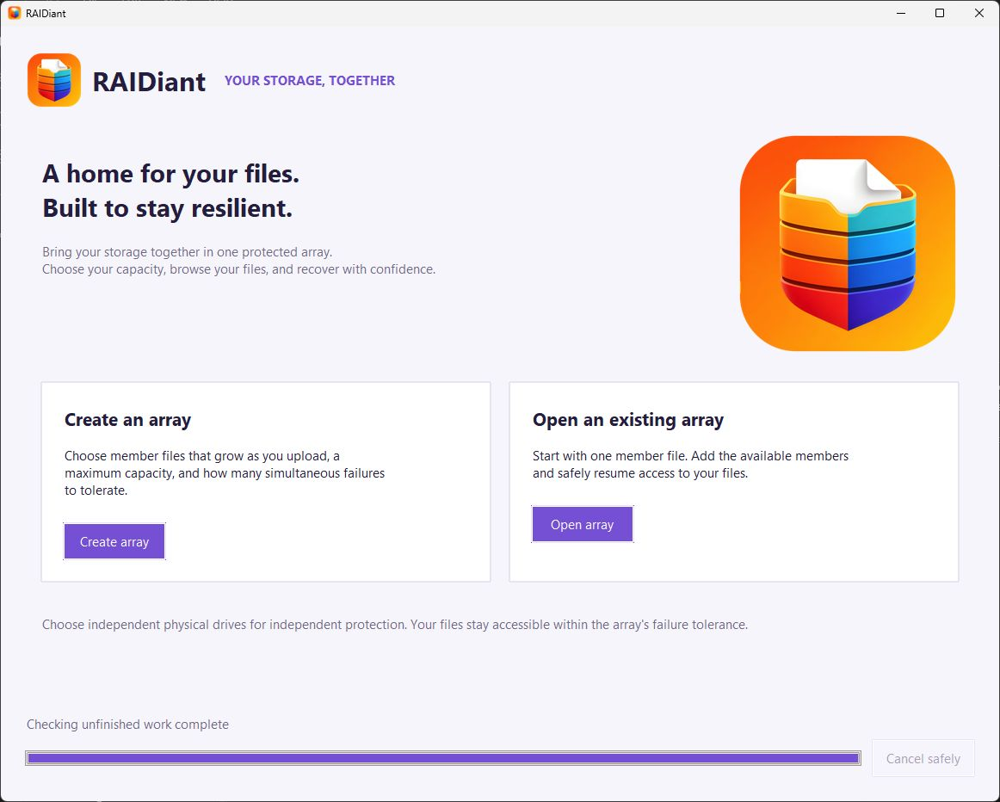
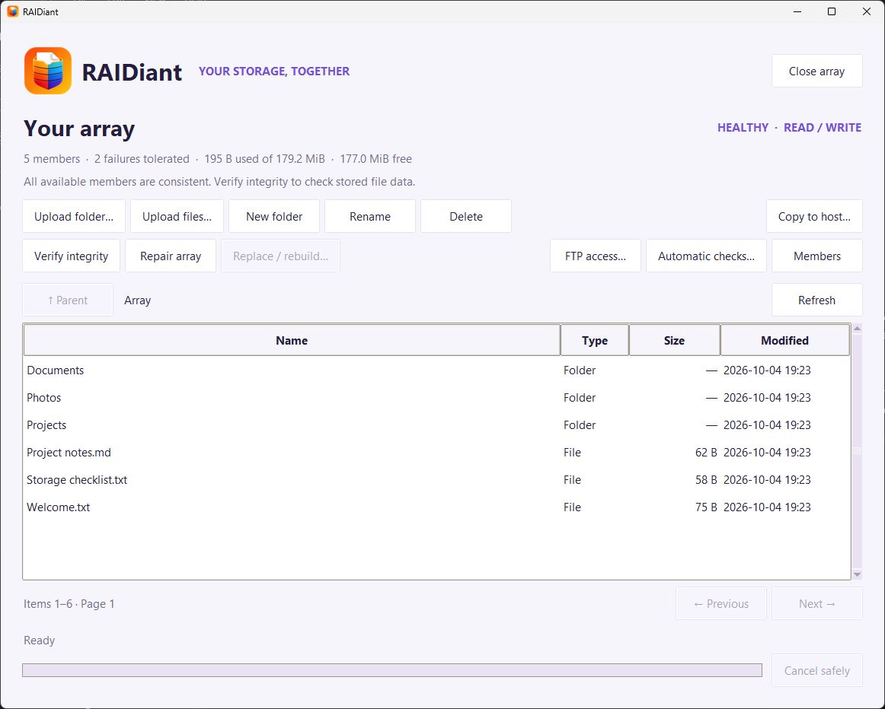

<p align="center">
  
</p>

# RAIDiant

Turn sparse ordinary drives into one protected array. Choose your level
of redundancy, add your files, and browse everything in a simple desktop app
for **Windows, macOS, and Debian**.

## What can it do?

- **Choose your protection.** Configure how many simultaneous member failures
  your array can tolerate. Use separate physical drives for independent protection.
- **Use space as you need it.** Member files grow as you upload, up to the limit
  you choose, instead of reserving the entire capacity at creation.
- **Keep file management simple.** Upload files or folders, create folders,
  rename and delete items, and copy verified files back to your computer.
- **Recover and rebuild.** Repair recoverable damage, replace missing members,
  and resume interrupted rebuilds. Browse and export while a rebuild runs.
- **Check your files' integrity.** Verify stored data with checksums and parity.
  Run checks manually or enable optional periodic checks.
- **Connect with an FTP client.** Access an open array from your computer or
  trusted local network, with the same storage and recovery restrictions.
- **Work with large arrays.** Data is processed in chunks to keep memory use
  bounded, rather than loading whole member files into RAM.
- **Run as a desktop app.** Build a Windows executable, a macOS app, or a Debian
  installer that adds RAIDiant to your Applications menu.

RAIDiant manages its own file catalog; it does not mount an OS drive letter or
filesystem. Redundancy protects against the configured number of member failures.
It does not replace a separate backup.

## Screenshots

Windows screenshots of version 0.3.4, refreshed on 2026-10-05 with disposable demo data.





See the [screenshots folder](screenshots/README.md) for array creation, automatic
checks, and FTP access. The example FTP server is stopped and its credentials
were discarded after capture.

## Members, shards, and stripes

Choose **N total members** and **M tolerated member failures**: any N−M verified
members can reconstruct the array's data. The supported range is 3–32 members,
with at least two data shards per stripe. RAIDiant uses rotating Reed–Solomon
parity; the first parity shard is XOR. Its proprietary format is not a Linux md
or hardware-controller disk image.

A **member** is one `.r5m` file. A **shard** is a chunk stored in one member,
including its identification/checksum header. A **stripe** contains one shard
from every member: N−M data shards and M parity shards. Parity positions rotate
between members. The default shard payload is 256 KiB.

For three members with one parity, each stripe contains two data chunks and one
parity chunk. Eleven stripes therefore contain 33 shards, eleven in each member.
Members are columns and stripes are rows; their counts do not have to match.
Integrity reports count occupied stripes checked, rather than all possible stripe
slots. Unused capacity is not a test of the underlying physical drive's health.

## Run

Simply download a [release](https://github.com/docfarzad/RAIDiant/releases/) for your operating system and processor and start using the app. 

If you are using any of the macOS versions, since I currently do not have an Apple Developer account, after you move **RAIDiant.app** to **Applications**, you need to run the following command in terminal to be able to then use the app:

```sh
xattr -dr com.apple.quarantine "/Applications/RAIDiant.app"
```

This removes the quarantine flag from RAIDiant only. It does **not** disable Gatekeeper system-wide or sign or notarize the app.

To run from source, Python 3.11 or newer, NumPy, pyftpdlib, and Tk are required:

```sh
python -m pip install -e ".[dev]"
python -m raidiant
```

On Debian, install `python3-tk` and `python3-venv`, create a virtual environment,
then use that environment's Python for the commands above. On Windows and macOS,
the standard python.org installer normally supplies Tk.

## Use

The interface uses each platform's native font family with a readable minimum
body size (11 points on Windows/Linux, 13 on macOS). Labels, inputs, status text,
menus, and reports share that size; larger system preferences are retained.
Windows fit the available display and content scrolls when larger text needs
more room, keeping actions accessible without shrinking the text.

On macOS, member creation, member replacement, and integrity-report saves use
the native save panel without Tk's optional **Format** row. This avoids its
oversized dropdown clipping the compact panel. Suggested filenames, default
extensions, cancellation, and native overwrite handling are retained. Windows
and Linux keep the file-type filters; open-file dialogs are unchanged.

1. **Create array:** choose the total member count and failure tolerance, then
   choose a new file location for every member. Enter a per-member maximum or
   calculate a recommendation. Capacity checks preserve an entered amount and
   unit; only an empty size field is filled automatically. Clicking **Create array**
   runs any needed capacity check and continues to confirmation. An amount above
   the safe recommendation is rejected without replacing the entered value.
   New members grow as data is uploaded; only their metadata/recovery area is reserved initially.
   Previously created, fully preallocated arrays remain supported. Bear in mind, if the storage location for the member files do not support our full range of operations, the app will not allow features that use those operations. For example, certain SMB file servers do not allow writing blocks of individual size. When encountering a member that is located on such a file server the app will refuse to upload files to it leaving you with only the possibility to read from the array. 
2. **Open array:** select one member, then select the additional members in the
   member dialog. At least N−M distinct valid members are required. Headers and
   transaction histories are checked before writes are enabled.
3. **Manage files:** upload files/folders, create folders, rename, delete, and copy
   to the host. Listings are paged. Exact duplicate names in one directory are
   prevented; imports automatically select a unique internal name.
4. **Rebuild missing:** choose replacement locations for absent members. Browsing
   and copying to the host remain available during reconstruction. Publication
   waits for active copies before switching source members. All mutations stay
   disabled until the array is healthy.
5. **Resume a rebuild:** reopen the surviving members and select the same incomplete
   replacement files in Rebuild missing. Checkpointed output is verified and reused.
   Uncheckpointed output is reconstructed again. Incomplete files never count as
   healthy members. Native allocation itself may not be immediately cancellable.
6. **Replace a failing present member:** open Members, select its row, and choose
   Replace selected member. The original file is preserved.
7. **Verify integrity / Repair array:** verification checks member headers, metadata
   histories, all live shards, parity, and every complete file's SHA-256. A detailed
   report lists all detected damaged files, rather than stopping at the first.
   Save the report before closing the array. Repair
   replays valid metadata, reconstructs identifiable bad shards when enough good
   shards remain, and writes a new metadata checkpoint. Ambiguous histories or
   insufficient surviving data are refused rather than guessed.
8. **Recover interrupted creation:** on the next launch, resume unfinished member
   allocation/publication, or remove owned unfinished files while allocation is
   still incomplete. Once ready headers have been published, creation must finish
   rather than deleting a potentially usable array. Changed or unrecognized files
   are preserved for manual inspection.
9. **Automatic checks:** scheduled member probes and periodic full integrity checks
   are both disabled by default. Enable either in Automatic checks. Member probes
   check identity, size, and headers every 30 seconds while idle. Full checks
   default to a weekly interval and start after five minutes of inactivity.
   Checks run only while the app and array are open. The first automatic full
   check is scheduled in the future. Checks on opening, reading, and writing
   remain mandatory; the scheduling preferences do not disable data validation.
10. **FTP access:** open FTP access from the array toolbar and start the server.
    The username and password are independently generated four-digit decimal
    strings, including possible leading zeroes, saved in this installation's
    settings until regenerated. Local-only access is the default; LAN access
    must be selected explicitly. The default port is 2121. The app and array
    must remain open, and closing the array stops its server. Simultaneous upload is not possible. You need to adjust your FTP client to run a single concurrent upload at a time. Streaming media directly from the FTP is also not possible due to the sparse nature of the storage system. 

FTP supports directory listing, uploads, downloads, folders, deletion, and rename.
It streams directly to/from the array without staging whole files on the host.
Existing names cannot be overwritten; append and transfer restart are refused.
Uploads become visible only after a successful durable commit. Aborted transfers,
socket errors, timeouts and server shutdown discard their unfinished file.
Standard FTP does not supply an expected upload length: an orderly data-socket
EOF is treated as completion, so a client intentionally ending early cannot be
distinguished from a shorter intended file. FTP clients must treat a failed download
as incomplete, even if some bytes have already arrived. Unusual array names use
reversible percent encoding in FTP paths. No host filesystem paths are exposed.

FTP honors the same exclusive-operation, degraded, and recovery restrictions as
the desktop. Transfers may be refused while another operation is active; downloads
are allowed during rebuild reconstruction. An active transfer holds its operation
lease, so a conflicting check, repair, or mutation cannot start halfway through it.
While a full integrity check or repair is active, new transfers are refused.
FTP is unencrypted and four-digit credentials are short: use localhost
or a trusted private network, not an Internet-facing port. No router or firewall
configuration is changed automatically.

| Array/operation state | FTP behavior |
| --- | --- |
| Healthy and idle | Browse, upload, download, rename, create/delete entries |
| Degraded or explicitly read-only | Browse and verified download; mutations refused |
| Upload/download already in progress | Conflicting operations refused until its lease ends |
| Rebuild reconstruction | Verified downloads allowed; writes refused |
| Rebuild publication | New shared reads blocked; active downloads drain before handles switch |
| Full verification or exclusive repair | New transfers refused |
| Interrupted metadata transaction | Transfers requiring trustworthy state blocked until recovery |
| Failure during upload | Transfer fails; unfinished file abandoned; recovery required if cleanup fails |
| Failure during download | Reconstruct from verified shards if possible; otherwise transfer fails |
| Stop FTP, regenerate credentials, or close array | Connections cancelled; unfinished uploads abandoned before closing members |

The FTP dialog shows `127.0.0.1` for local-only access and detected local IPv4
addresses for LAN access, alongside the port and credentials. With multiple
adapters, choose the address reachable from the client. Address detection does
not configure a firewall; allow the application on your private network if the
OS asks. Passive data connections also need to be permitted by that firewall.

A read failure disables writes and the desktop offers **Repair now**, **Replace
affected members**, or **Browse read-only** once active operations reach a safe
boundary. Enough verified shards must survive to reconstruct each stripe. Hard
header/metadata failures isolate the affected member; checksum damage can be
repaired in place. If recovery is impossible, the app reports damage and does not
invent content. Healthy files remain exportable when their catalog is trustworthy.

An explicitly read-only session must be closed and reopened with write access
before repair or rebuilding. Degraded sessions automatically become writable
after successful repair/rebuild; they do not need to be reopened.

## Capacity and performance

- Equal member lengths are chosen per shared allocation pool, with a reserve of
  the larger of 5% free space or 64 MiB. Multiple members on one volume divide its
  available capacity. Size changes at creation must remain within the safe bound.
- Usable file capacity is roughly `(N − M) × member data capacity`, after metadata,
  shard headers, and last-stripe padding. Deleted storage is reused, including
  fragmented free ranges. Grow-on-demand members release an unused appended
  tail; free regions below live data remain available for reuse. Fully preallocated
  members retain their fixed length.
- Members reserve two metadata banks, each between 64 KiB and 512 MiB, plus
  8 KiB of headers. Each bank is approximately 1/32 of the configured member
  maximum, capped at 512 MiB. A multi-terabyte member therefore initially reserves
  about 1 GiB of recovery/catalog space, rather than its full data capacity. This
  preserves the existing metadata capacity. Very large numbers of files can
  exhaust metadata capacity before data capacity.
- The chosen maximum remains a logical limit, not reserved host space. Other
  applications, quotas, or snapshots can consume physical capacity later.
  Running out of physical space stops the upload; previously committed files
  are retained. Repeated aborted uploads reuse recovered space rather than
  accumulating untracked member growth.
- Data buffers, coding scratch, directory pages, and the SQLite page cache are
  bounded independently of array capacity. The catalog and recovery log are indexed
  in a disposable local temporary directory. Temporary disk usage scales with
  metadata, not with total stored file data.
- The default chunk is 256 KiB. Parity work is NumPy accelerated. Rebuilding and
  verification are proportional to live stored data; terabyte arrays can take
  hours. Rebuilds reconstruct allocated stripes; unused space has no file content.

## Durability and recovery contract

The engine writes new file data only into free stripes and synchronizes every
member before committing the corresponding metadata. A file becomes visible only
after its final commit. A failed folder import can retain completed files and
directories while discarding its unfinished file. Rename and subtree deletion
are single metadata transactions. A deleted file is not retained as an undo copy.

Metadata is a checksummed, hash-chained log replicated on all members. Compaction
writes an alternate bank before publishing alternating checksummed root headers.
After a crash, identical log prefixes can be reconciled; conflicting histories
are refused. Stale root headers also require recovery before further writes.
Incomplete upload allocations are reclaimed during recovery. Format 3 records
allocation intent before extending a member. Recovery checkpoints the surviving
catalog before truncating an unused tail, so interruption during cleanup can be
recovered again. If cleanup cannot finish, writes remain disabled and repair can
be retried when the destination is accessible. Cleanup runs when the app opens
and recovers the array, not while the process is closed. Reclaiming storage is
not secure erasure, and host snapshots can retain old physical blocks.

Creation manifests and locked disposable catalogs are stored in the user's local
application state directory. Startup removes verified abandoned catalog/export
temporary files and offers recovery of unfinished creations. Cleanup does not
run while the app is closed, and inaccessible volumes are left for a later launch.
Recovery records use file identities and ownership tokens; losing these local
records does not damage completed arrays, but can require manual cleanup of
unfinished creation files.

Replacement rebuilds upgrade legacy member headers to format 2 and publish an
incarnation roster. New grow-on-demand arrays use format 3 and retain that roster.
Current members reject old, retired copies. Format 1/2 arrays remain readable;
older application versions reject format 3. A completely
disconnected, internally consistent historical member set cannot know about newer
replacements. Originals are preserved rather than erased.

If a replacement became ready just before a crash interrupted membership
publication, select it again in Rebuild to complete installation, or open it
together with the surviving members and choose Repair. The app validates its
array, slot, membership history, actual metadata chain, and shard checksums before
adopting it. A ready file with an unrelated or conflicting history is preserved
and refused. This includes the case where only some survivors received the new
membership generation.

Write and synchronization failures stop mutations immediately. Repair uses
preallocated metadata space, so it does not depend on extending the member files.
The OS/device must actually honor allocation and flush requests. Windows,
macOS, and Linux use their respective host synchronization mechanisms; Windows
does not provide the same portable directory-fsync contract as POSIX.

Slow host I/O is surfaced after 30 seconds without freezing the window. Cancellation
is cooperative; a native read, allocation or flush must return before its thread
can safely stop. The application cannot impose hardware-controller timeouts on
every filesystem or override a stalled kernel/device driver.

This implementation has automated fault tests and Windows packaging validation;
it is **not yet production-qualified storage software**. In particular:

- Member loss tolerance assumes independent failures. Several files or partitions
  on one physical disk can all disappear together. Pool discovery cannot prove
  independent physical devices.
- Network shares, live cloud synchronization, external member modification,
  shared copies/snapshots, and faulty device firmware can weaken the model. The
  supported durability contract is for tested local filesystems honoring flushes.
- Session locks coordinate cooperating processes. They cannot stop every external
  program from modifying or replacing files on every OS.
- Checksums detect corruption; they do not authenticate hostile modifications.
  More than M unavailable shards in a stripe cannot be reconstructed. Recovery
  never substitutes zeroes for missing user data.
- Copies from different points in time are not interchangeable backups of the
  whole array. Copy a closed, consistent member set when making a backup.
- Automatic recovery after interruption can retain an operation whose completion
  was not reported. Previously acknowledged operations must remain consistent
  within the supported failure model.

Keep another copy of valuable data while the implementation gains wider platform,
power-failure, filesystem, and large-capacity validation.

## Names and host export

Internal names are independent of host paths: slashes, reserved Windows names,
and other unusual labels are supported. Names must contain 1–4096 UTF-8 bytes,
cannot contain NUL, and must be unique within their parent directory.

Exports sanitize components, resolve case/Unicode/sanitization collisions, and
never overwrite existing files. File data is checksum-verified in a temporary
file before atomic, non-overwriting publication. On filesystems without hard links,
the app uses native exclusive rename. Unsupported atomic publication is reported
as an error instead of exposing a partially copied final file. Temporary exports
are tracked for next-launch cleanup. Folder exports are incremental, so cancellation can leave
completed children. Folder exports include a name-mapping TSV.

Import skips dotfiles, OS-hidden/system entries, hidden subtrees, symlinks,
Windows junctions, and non-regular special files. Imported objects stay visible
even if renamed to start with a dot. Host permissions, ACLs, extended attributes,
resource forks, hard-link relationships, and sparse layouts are not preserved.

## Verify and package

### Pinned build environment

The Windows build is validated with **CPython 3.13.2, 64-bit**, and the following
installed package versions. [requirements-build.txt](requirements-build.txt)
pins these dependencies and applies platform markers to OS-specific packages.

| Package | Version | Purpose |
| --- | --- | --- |
| NumPy | 2.2.4 | Reed–Solomon calculations |
| pyftpdlib | 2.2.0 | FTP protocol/server |
| pyasynchat / pyasyncore | 1.0.5 / 1.0.5 | FTP compatibility on Python 3.12+ |
| PyInstaller | 6.13.0 | Native executable packaging |
| pyinstaller-hooks-contrib | 2025.4 | Dependency collection |
| setuptools / wheel | 80.9.0 / 0.45.1 | Python package build tools |
| packaging / altgraph | 24.2 / 0.17.4 | Build dependencies |
| pefile / pywin32-ctypes | 2023.2.7 / 0.2.3 | Windows build dependencies |
| pip | 26.2.1 | Installer used on the validation machine |
| pytest | 9.1.1 | Optional tests; not needed to build |

The macOS-only dependency `macholib==1.16.3` is also pinned. It is not installed on
the Windows validation machine. Tk comes from Python or the OS package manager,
not from pip. OS package versions depend on the target OS; the Python package
pins are shared. Native macOS and Debian builds must still be validated there.

Build on the OS and CPU architecture you intend to support. PyInstaller does
not cross-compile. A Windows build does not produce macOS or Debian binaries.
See the [PyInstaller platform requirements](https://pyinstaller.org/en/v6.13.0/requirements.html).

Run the commands below from the repository root, containing `main.py` and
`RAIDiant.spec`. They install dependencies and build, without launching the app
or running tests. **The normal build takes two commands:** install the pinned
requirements, then run PyInstaller. There is no need to install RAIDiant itself,
upgrade pip to the validation machine's version, or activate an environment.
The matching `build-*.txt` files contain the same commands. For a Debian installer,
the ready-to-run script below performs setup, executable building, and `.deb`
packaging in one command.

A virtual environment isolates build dependencies from other Python projects. It
is optional when you already have a suitable writable Python installation, such
as python.org Python on Windows. Debian's system Python and Homebrew Python are
externally managed, so use a virtual environment for those installations. Create
it once; the routine commands call its Python directly and need no activation.
See the [Python packaging specification](https://packaging.python.org/en/latest/specifications/externally-managed-environments/)
and [Homebrew guidance](https://docs.brew.sh/Language-Runtimes-and-Packages).

### Windows — PowerShell

With Python 3.13, Tk, and pip already installed:

```powershell
py -3.13 -m pip install -r requirements-build.txt
py -3.13 -m PyInstaller --clean --noconfirm RAIDiant.spec
```

One-time prerequisite, only if Python is missing; reopen PowerShell afterwards:

```powershell
winget install --id Python.Python.3.13 --exact --source winget --accept-package-agreements --accept-source-agreements
```

For optional isolation, run `py -3.13 -m venv .venv` once, then replace
`py -3.13` in both build commands with `& .\.venv\Scripts\python.exe`.

Output: **`dist/RAIDiant.exe`**, a single windowed executable with no Python
installation required on the destination machine.

### macOS — Terminal

With the environment below already set up:

```sh
.venv/bin/python -m pip install -r requirements-build.txt
.venv/bin/python -m PyInstaller --clean --noconfirm RAIDiant.spec
```

One-time setup using [Homebrew](https://brew.sh/), installed separately if needed:

```sh
brew install python@3.13 python-tk@3.13
"$(brew --prefix python@3.13)/bin/python3.13" -m venv .venv
```

If you already use a writable Python 3.11+ installation with Tk and pip, replace
`.venv/bin/python` in the two build commands with that interpreter and skip setup.

Output: **`dist/RAIDiant.app`**, wrapping the one-file executable with the supplied
Finder/Dock icon. PyInstaller also leaves the standalone `dist/RAIDiant` binary.
Distribute the `.app` for the native icon. Signing and notarization are separate
distribution steps. Build separately for Apple Silicon and Intel unless using a
fully compatible universal2 Python and dependency set.

### Debian 12 or newer — Terminal

**Recommended: build an installable `.deb` and the standalone app.** Copy the
whole project to Debian 12 or 13 (amd64 or arm64), then run:

```sh
bash build-debian.sh
```

The script installs system build dependencies through `sudo apt-get`, creates a
dedicated `.venv-debian` environment, installs the unchanged pinned Python
requirements, builds with PyInstaller, and prepares
**`dist/raidiant_0.3.4-1_amd64.deb`** (or `_arm64.deb`). It also leaves the
standalone `dist/RAIDiant` executable and its launcher assets. Run the script as
your normal user; only system dependency installation needs elevated privileges.
The project must be writable, and setup needs an internet connection.

The script does **not** install or launch RAIDiant. It prints the exact package
installation command when finished. For this version on amd64:

```sh
sudo apt install ./dist/raidiant_0.3.4-1_amd64.deb
```

Installing the package adds **RAIDiant to your desktop's Applications menu**,
with its supplied icon. Debian uses a menu entry rather than a macOS-style
Applications folder. The executable lives at `/opt/raidiant/RAIDiant`; a link at
`/usr/bin/RAIDiant` also lets you launch it from a terminal. The package installs
the desktop entry under `/usr/share/applications` and the icon sizes under
`/usr/share/icons/hicolor`. Menu updates use the desktop's normal package triggers.
See [Debian's menu policy](https://www.debian.org/doc/debian-policy/ch-opersys.html#menus).

The receiving desktop does not need Python or pip. APT installs the declared
system dependencies, including glibc, XCB, font configuration, and fonts. The
graphical app needs an X11 or XWayland desktop session. To uninstall:

```sh
sudo apt remove raidiant
```

Removal leaves user settings and RAID member files intact. Temporary package and
PyInstaller staging are removed on success or failure; `.venv-debian` remains for
future builds. Packaging completes before replacing prior output files.

Build on **Debian 12 for Debian 12+ compatibility**. Building on Debian 13 records
its newer glibc minimum in the package and does not make a Debian 12-compatible
binary. The pinned build currently requires Python 3.11–3.13. Build separately
for amd64 and arm64. This follows [PyInstaller's Linux portability guidance](https://pyinstaller.org/en/v6.13.0/usage.html#making-gnu-linux-apps-forward-compatible).

**Executable-only alternative:**

With the environment below already set up:

```sh
.venv/bin/python -m pip install -r requirements-build.txt
.venv/bin/python -m PyInstaller --clean --noconfirm RAIDiant.spec
```

One-time setup, if the system packages or project environment are missing:

```sh
sudo apt-get update
sudo apt-get install -y python3 python3-venv python3-tk binutils ca-certificates
python3 -m venv .venv
```

If you already use a suitable user-managed Python environment with Tk, use its
interpreter in the two build commands instead. Do not install pip packages into
Debian's externally managed system Python.

Output: **`dist/RAIDiant`**, a single executable, plus optional `RAIDiant.png` and
`RAIDiant.desktop` launcher assets. Linux ELF executables have no Windows-style
embedded executable icon; the window and desktop launcher use PNG representations.
Build on the oldest Debian
release you intend to support, then test on each supported desktop environment.

Optional per-user application-menu integration after building (no root required):

```sh
install -Dm755 dist/RAIDiant "$HOME/.local/bin/RAIDiant"
install -Dm644 dist/RAIDiant.png "$HOME/.local/share/icons/hicolor/512x512/apps/raidiant.png"
install -Dm644 dist/RAIDiant.desktop "$HOME/.local/share/applications/RAIDiant.desktop"
```

Ensure `$HOME/.local/bin` is on your desktop session's PATH. These installation
commands are separate from the two normal build commands.

### Tests and bundled diagnostic

Tests are optional for packaging but recommended before distributing a change:

```sh
python -m pip install "pytest==9.1.1"
python -m pytest -q
python -m raidiant --self-test
python -m raidiant --gui-smoke-test
python -m PyInstaller --clean --noconfirm RAIDiant.spec
```

The bundled diagnostic creates a temporary five-member array, imports a file,
checks a real loopback FTP upload/download/delete, opens with two members absent,
verifies export, rebuilds, and scrubs. It also verifies a spawned helper and shared
memory roundtrip; on macOS/Linux it checks the resource tracker's clean exit.
Temporary diagnostic data and preferences are isolated from the user's settings.
To record results from a windowed executable:

```sh
RAIDiant --self-test --report self-test.json
```

For the macOS app bundle:

```sh
./dist/RAIDiant.app/Contents/MacOS/RAIDiant --gui-smoke-test --report mac-test.json
```

The report should contain `"ok": true` without `resource_tracker` crashes or
`unrecognized arguments: -B -S -I -c` errors. Version 0.3.4 dispatches PyInstaller's
multiprocessing helpers before parsing normal application arguments. An older
diagnostic could finish its storage checks successfully while the separate
resource-tracker process failed; such output was not a clean pass. This fix uses
the standard `multiprocessing.freeze_support()` entry-point handling and does not
require new packages. See [PyInstaller's multiprocessing guidance](https://pyinstaller.org/en/v6.13.0/common-issues-and-pitfalls.html#multi-processing).

Build separately on Windows, macOS, and Debian; PyInstaller is not a cross-compiler.
Windows produces `dist/RAIDiant.exe`; Linux produces `dist/RAIDiant`; macOS also
produces `dist/RAIDiant.app`. The included CI workflow describes native builds and
tests for Windows/macOS and Debian Bookworm. Those remote jobs have not been run
merely by creating the workflow. Distributable macOS builds also need signing and
notarization according to the intended distribution channel.

See [FORMAT.md](FORMAT.md) for format and recovery details.

Validation on Windows for version 0.3.2 (2026-10-03): **168 tests and 21 subtests passed**,
including process termination during allocation/cleanup, physical-space failures,
interrupted replacement installation, FTP abort/reset/shutdown, transfers during
rebuild, settings persistence, desktop coordination, and preserving exact manual
capacity values before and during asynchronous checks, readable typography,
constrained-window scrolling, and complete icon representations. The source and packaged
Windows executable both passed the GUI/storage/FTP diagnostic. Native
macOS/Debian execution, physical power-loss,
and multi-terabyte endurance testing remain separate validation work.

Version 0.3.3 (2026-10-04) passed **33 focused GUI, native-dialog option, and icon
tests**, plus the packaged Windows GUI/storage/FTP diagnostic. Its macOS save-panel
workaround follows the [upstream Tk implementation](https://github.com/tcltk/tk/blob/core-8-6-branch/macosx/tkMacOSXDialog.c).
Native macOS visual verification is still required.

Version 0.3.4 (2026-10-04) passed the full Windows suite: **190 tests and 21
subtests**, including helper-process failure/timeout cleanup, isolated diagnostic
settings, and the replacement icon set. Both source and packaged Windows builds
passed the GUI/storage/FTP and spawned-worker/shared-memory diagnostic. All 13
Windows icon frames embedded in the executable match the new assets. The macOS
resource-tracker fix still requires rerunning the bundled diagnostic on macOS;
native macOS/Debian testing has not been performed on this Windows machine.

Application, window, taskbar, and in-app icons now use the supplied **RAIDiant Icons.zip** artwork with complete
platform representations: macOS standard and Retina sizes, Windows list-view and
display-scaling sizes, and Linux PNGs plus an optional desktop launcher. The supplied
macOS ICNS and PNG frames are preserved unchanged, including the supplied
1024-pixel image. Four additional Windows scaling sizes are downsampled from that image.
See [icon details](raidiant/assets/ICONS.md). The screenshots above show the current artwork.
Build-only dependency and packaging commands are in
`build-windows.txt`, `build-macos.txt` and `build-debian.txt`.

## Repository layout

- `raidiant/`: storage engine, host I/O, recovery, desktop, FTP, and icons.
- `tests/`: fault injection, process termination, integrity, FTP, and GUI tests.
- `screenshots/`: desktop screenshots with disposable demo data and a gallery.
- `FORMAT.md`: member layout and recovery rules.
- `requirements-build.txt`, `pyproject.toml`, `RAIDiant.spec`: dependencies and packaging.
- `build-windows.txt`, `build-macos.txt`, `build-debian.txt`: install/build commands.
- `build-debian.sh`: dependency setup, native executable build, and installable Debian package.
- `.github/workflows/build.yml`: native platform build/test workflow.
- `tools/generate-icons.ps1`: optional maintainer tool for regenerating committed icon assets.
- `dist/`: latest local build only; generated caches, scratch diagnostics, and
  intermediate build output are unnecessary for using the executable.
