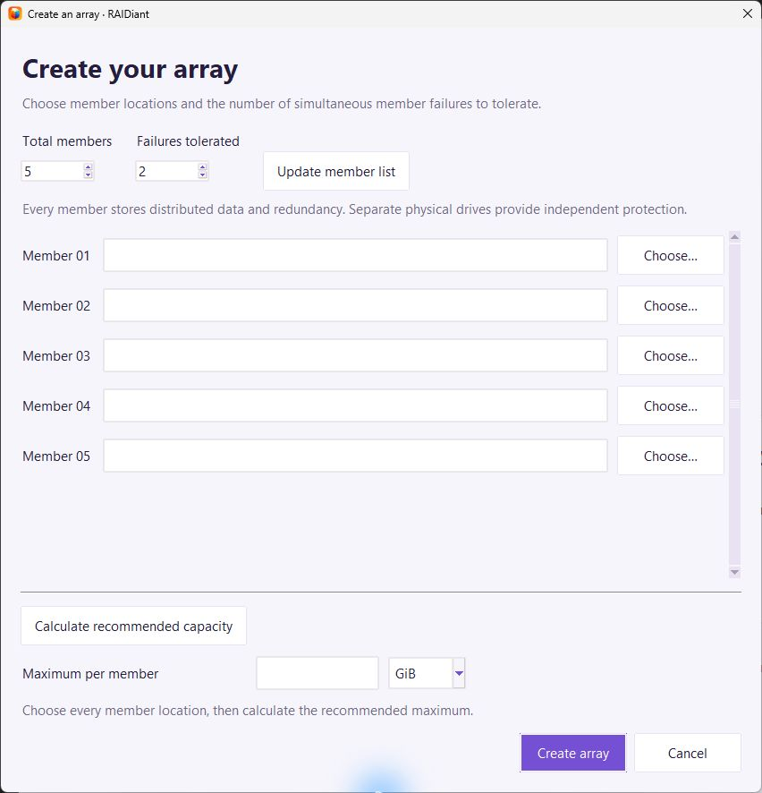
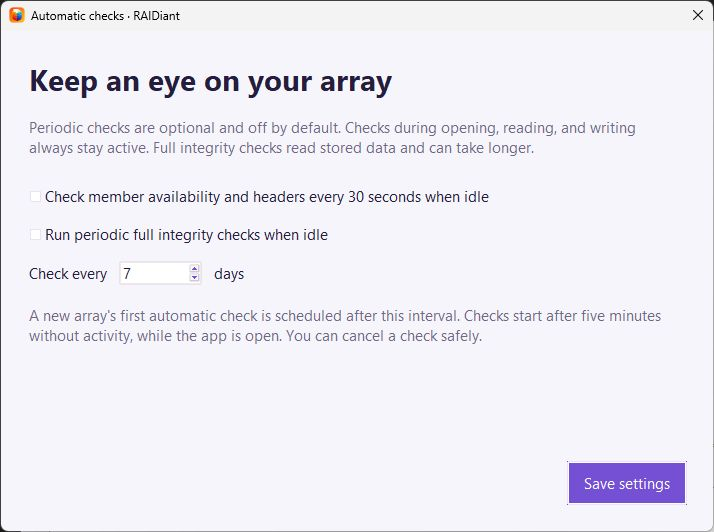
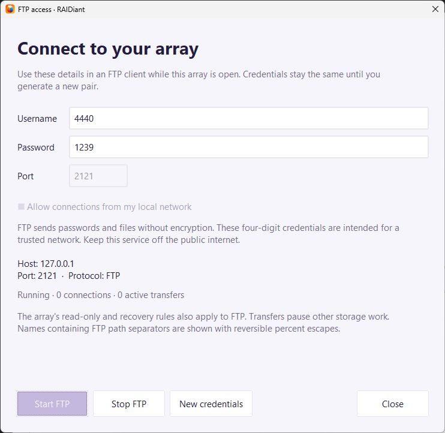

# RAIDiant screenshots

Captured from the Windows desktop app, version 0.3.4, on 2026-10-05. Screenshots
show the current app icons and use disposable demo files and isolated preferences.
These are actual window captures, including Windows title bars; no interface
content is redrawn. Windows were enlarged where needed to show the controls.

## Home

Create a new array or open an existing one.

## Create an array

The setup screen starts with **five members and two tolerated failures**.
Choose each destination, calculate a recommended maximum, or enter a capacity.
This capture shows the initial setup before locations or capacity were selected;
no array was created from this dialog. Use independent physical drives for
independent protection.

## File manager

A healthy five-member array tolerating two simultaneous member failures, with
sample folders and files.

## Automatic checks

Both periodic checks are disabled by default. Checks during normal storage
operations remain enabled.

## FTP access

The example server listens only on loopback, at `127.0.0.1:2121`.
Its credentials belong to the discarded demo preferences. The server was stopped
after capture; these details are not a live connection. Enable local-network
access in your own session to show detected LAN addresses.

